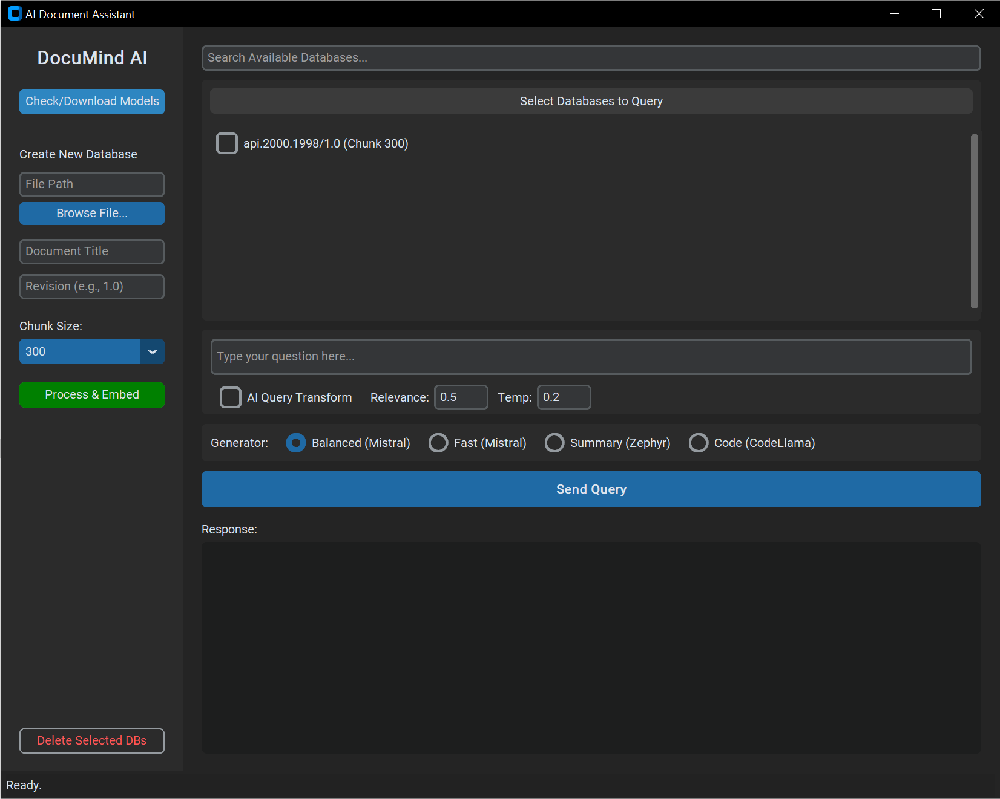
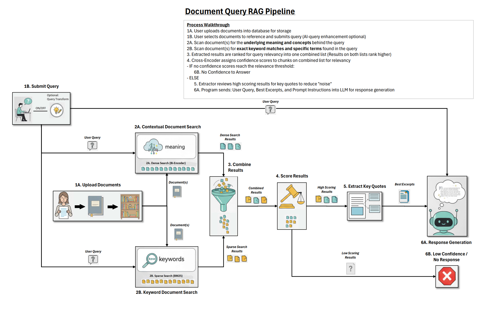

Local RAG Knowledge Base & Document Assistant
A privacy-first, offline Retrieval-Augmented Generation (RAG) pipeline capable of hybrid retrieval, cross-encoder re-ranking, and intelligent VRAM management.

📖 Overview
This application is a desktop-based Knowledge Assistant that allows users to ingest technical documents (PDF, DOCX, TXT) and query them using advanced AI techniques. Unlike standard RAG setups, this project runs 100% locally on consumer hardware (optimized for 8GB VRAM) ensuring total data privacy.

It features a custom-built Hybrid Retrieval Pipeline that combines keyword precision (BM25) with semantic understanding (Dense Vector Search), refined by a Cross-Encoder to ensure high-accuracy answers with strict citations.

✨ Key Features
🔒 100% Offline & Secure: No data leaves the machine. Uses local models (Mistral, Zephyr, BGE-M3) via llama.cpp and HuggingFace.

🧠 Hybrid Retrieval (Dense + Sparse): Fuses ChromaDB (Vector/Semantic) and BM25 (Keyword) search results using Reciprocal Rank Fusion (RRF) for superior recall.

⚖️ High-Precision Re-Ranking: Uses a Cross-Encoder (bge-reranker-large) to score document relevance at a granular level.

🛡️ Tiered Confidence & Safety Net:

High Confidence: Generates direct, cited answers.

Low Confidence: Uses "cautious" prompts to avoid hallucinations.

No Confidence: Refuses to answer to maintain factuality.

Safety Net: Proactively scans unselected databases to suggest relevant documents the user might have missed.

📑 Map-Reduce Summarization: Automatically generates succinct summaries for documents of any length (even 100k+ tokens) upon ingestion.

⚡ Smart VRAM Management: Custom logic "juggles" heavy models (Embedder, Re-ranker, LLM) in and out of GPU memory to run a pipeline that normally requires enterprise hardware on a standard RTX 3070.

⚙️ Architecture
The pipeline follows a strictly strict multi-stage process to ensure accuracy:

Ingestion: Documents are split into chunks and indexed in ChromaDB. A Map-Reduce algorithm generates a global document summary stored as metadata.

Hybrid Retrieval: The system queries both the Vector Store (Dense) and a local BM25 index (Sparse).

Fusion: Results are merged using Reciprocal Rank Fusion (RRF) to prioritize chunks that appear in both searches.

Re-Ranking: A Cross-Encoder re-evaluates the top 100 candidates, comparing the query and document text directly.

Adaptive Gating:

Safety Net Check: Piggybacks on the loaded re-ranker to scan unselected databases for relevance.

Confidence Check: Routes the context to different prompt strategies based on the re-ranker score.

Extraction & Generation: An extraction model (roberta-squad2) isolates the specific answer span, which is then synthesized by the LLM (Mistral-7B) into a final, cited response.

🚀 Installation
Prerequisites
Python 3.10+

NVIDIA GPU (8GB VRAM recommended) with CUDA installed.

C++ Build Tools (for compiling llama-cpp-python).

Setup
Clone the repository:

Bash

git clone https://github.com/tamman86/PDFReader.git

cd PDFReader

Install dependencies:

Bash

pip install -r requirements.txt
Download Models: Launch the GUI and click the "Download All Required Models" button. This will automatically fetch:

bge-large-en-v1.5 (Embedding)

bge-reranker-large (Cross-Encoder)

mistral-7b-instruct-v0.2 (GGUF)

roberta-base-squad2 (Extractor)

🖥️ Usage
1. Create a Database
Launch the application: python Ollama_GUI.py

Under "Create Database", select a file (PDF/DOCX).

Enter a Title and Revision.

Click Create.

Note: Large documents will trigger the Map-Reduce summarizer, which may take a few moments.

2. Querying
Select the databases you wish to search from the checklist.

Type your question.

(Optional) Enable "Query Transform Assist" for vague questions.

(Optional) Adjust Relevance Threshold (Default 0.5) or Temperature (Default 0.2).

Click Send Query.

3. Understanding Output
Orange Text: Suggestions for documents you didn't select but should have.

Blue Text: Clickable citations [1] that show the source context.

Standard Text: The generated answer.

🛠️ Configuration
Advanced settings can be tweaked in the config dictionaries found in Ollama_Readerv2.py:

Python

CONFIG = {

    "retrieval_k": 60,        # Number of chunks to fetch per search method
    "top_k_results": 5,       # Max chunks sent to LLM
    "hybrid_rrf_k": 60,       # Fusion constant
    "chunk_size": 512         # Default chunking size
}